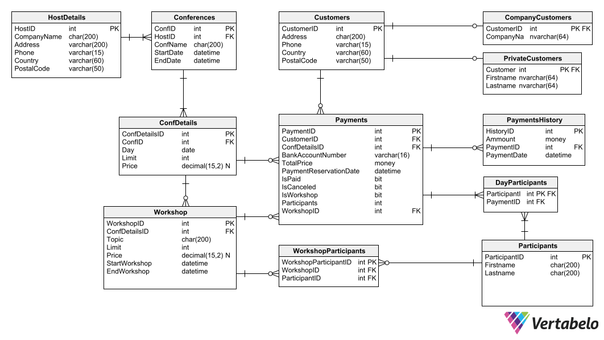

# agh-database-conferences
University project for DB course in Transact-SQL

### DB diagram

### Views 

1. ShowConferences

1. ShowWorkshops

1. ShowParticipants

1. ShowPaymentDetails

1. ShowCustomers

1. PaymetsStatistics

1. FreeSeatsWorkshops

1. ShowPrice

1. MostActiveCustomer

1. MostActiveCustomerPrivatePaymentSum

1. MostActiveCustomerCompanyPaymentSum

1. MostActiveCustomerPrivateWorkshopAttendee
