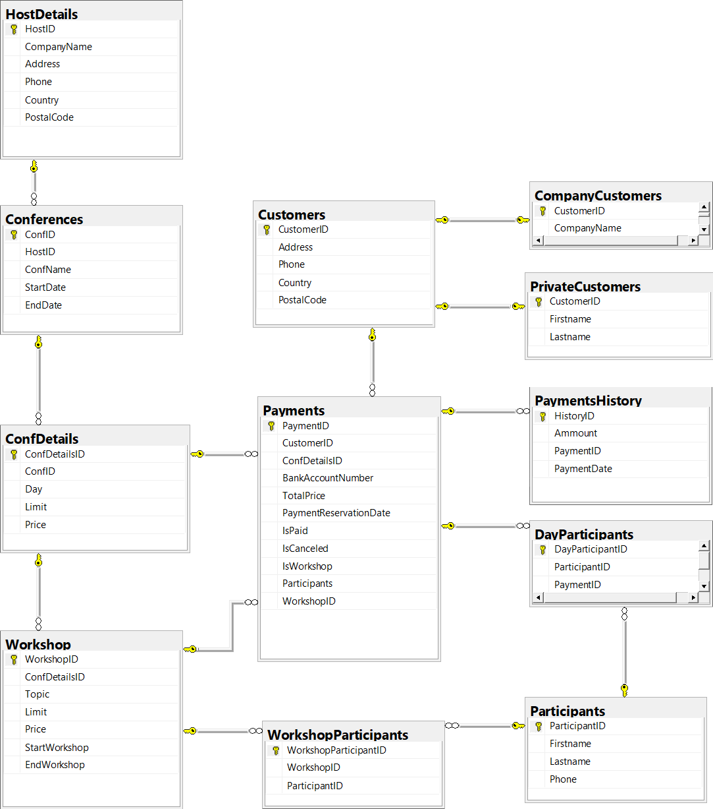

# agh-database-conferences
University project for DB course in Transact-SQL. Project done with an imposed outline.
Simple PDF-generated documentation (only in polish) can be found in this repo. There is plenty of room for improvement.

### DB diagram

### Procedures 

1. AddConfDetails - To fill in days of conferences. Each day can cost different ammount of money. Can be free of charge.

1. AddConference - To add conferences.

1. AddCustomerCompany - To add customer as a company

1. AddCustomerPrivate - To add customer as a private person

1. AddParticipant - To add participant (In all of the above there can be included more informations)

1. AddPayment - To add payment for given day. Payment must be paid 14 days before the first day of given conference.

1. AddWorkshop - To add workshop in given day of conference. Workshops can be free of charge.

1. AssignParticipantToWorkshop - To assign participant to workshop on given conference day.

1. CancelPayment - To cancel payment

1. CheckPaymentsDate - Check if payments are made in time

1. PartialPayment - History of payments. If someones payment is for 200$ he can pay in parts. (195$ and then 5$)

1. UpdatePaymentParticipants - If somone changed ther mind how many participants there should be. Ammont of money for payment is updated but excess amounts are considered as donation.
